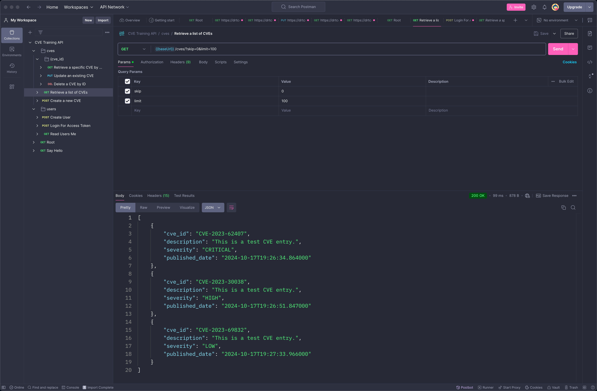

# FastAPI CVE Management API - Postman Tutorial

Welcome to the FastAPI CVE Management API tutorial! This guide will walk you through using **Postman** to interact with your FastAPI server, performing actions such as creating users, managing CVEs (Common Vulnerabilities and Exposures), and handling authentication concepts.

## Table of Contents

1. [Prerequisites](#prerequisites)
2. [Setting Up Postman](#setting-up-postman)
3. [API Endpoints Overview](#api-endpoints-overview)
4. [Step-by-Step Guide](#step-by-step-guide)
    - [1. Create a New User](#1-create-a-new-user)
    - [2. Log In to Obtain an Access Token](#2-log-in-to-obtain-an-access-token)
    - [3. Retrieve Current User Information](#3-retrieve-current-user-information)
    - [4. Create a New CVE Entry](#4-create-a-new-cve-entry)
    - [5. List All CVEs](#5-list-all-cves)
    - [6. Retrieve a Specific CVE](#6-retrieve-a-specific-cve)
    - [7. Update a CVE Entry](#7-update-a-cve-entry)
    - [8. Delete a CVE Entry](#8-delete-a-cve-entry)
5. [Conclusion](#conclusion)

---

## Prerequisites

Before you begin, ensure you have the following:

- **FastAPI Server**: There is an API server on the public internet running at: `https://api-intro-app-vhrnt.ondigitalocean.app`.
- **API Documentation**: There is API documentation available at: [https://api-intro-app-vhrnt.ondigitalocean.app/docs](https://api-intro-app-vhrnt.ondigitalocean.app/docs).
- **Postman**: Download and install Postman from [here](https://www.postman.com/downloads/).
- **Basic Understanding of APIs**: Familiarity with API concepts and HTTP methods.

---

## Setting Up Postman

1. **Install Postman**: If you haven't already, download and install Postman from the [official website](https://www.postman.com/downloads/).

2. **(Optional, but recommended) Import the API Collection**:
    - Grab the link to the API schema to import into postman:
        [API Schema](https://api-intro-app-vhrnt.ondigitalocean.app/openapi.json)
    - Open Postman.
    - Click on **Import** in the top left.
    - Paste the API schema URL into the top box.
    - Select **Postman Collection** as the format.
    - Click **Import**.
    - The collection should now be available in Postman.
    - Expand **CVE Training API** to see the available endpoints.
    - Click the **Root** endpoint for example.
    - Hover over **{{baseUrl}}** and replace the value to `https://api-intro-app-vhrnt.ondigitalocean.app` (This can be tricky).

2. **(Optional, not recommended) Create a New Collection**:
    - Open Postman.
    - Click on **Collections** in the left sidebar.
    - Click the **+ New Collection** button.
    - Name your collection, e.g., `FastAPI CVE Management`.

---

## API Endpoints Overview

Here's a summary of the API endpoints we'll interact with:

| Endpoint            | Method | Description                      |
|---------------------|--------|----------------------------------|
| `/users/`           | POST   | Create a new user                |
| `/users/token`      | POST   | User login to obtain access token|
| `/users/me`         | GET    | Retrieve current user information|
| `/cves/`            | POST   | Create a new CVE entry           |
| `/cves/`            | GET    | List all CVEs                    |
| `/cves/{cve_id}`    | GET    | Retrieve a specific CVE           |
| `/cves/{cve_id}`    | PUT    | Update a specific CVE             |
| `/cves/{cve_id}`    | DELETE | Delete a specific CVE             |

---

## Step-by-Step Guide

### 1. Create a New User

**Purpose**: Register a new user in the system. 

**Note**: ⚠️ Do not enter sensitive information into this system ⚠️

**Endpoint**: `POST /users/`

**Steps**:

1. **Create a New Request**:
    - Click **+** to open a new tab.
    - Set the request type to `POST`.
    - URL: `{{baseUrl}}/users/`

2. **Set Headers**:
    - Click on the **Headers** tab.
    - Ensure `Content-Type` is set to `application/json`.

3. **Set Body**:
    - Click on the **Body** tab.
    - Select **raw** and choose **JSON** from the dropdown.
    - Enter the following JSON, replacing values to create a new user:

    ```json
    {
        "email": "user_unique@example.com",
        "full_name": "Test User",
        "password": "password123"
    }
    ```

4. **Send the Request**:
    - Click **Send**.
    - **Expected Response**: `200 OK` with a success message.

5. **Save the Request**:
    - Click **Save** and add it to the `FastAPI CVE Management` collection.

---

### 2. Log In to Obtain an Access Token

**Purpose**: Authenticate the user and receive a JWT access token.

**Endpoint**: `POST /users/token`

**Steps**:

1. **Create a New Request**:
    - Click **+** to open a new tab.
    - Set the request type to `POST`.
    - URL: `{{baseUrl}}/users/token`

2. **Set Headers**:
    - Ensure `Content-Type` is set to `application/json`.

3. **Set Body**:
    - Select **raw** and choose **JSON**.
    - Enter the following JSON with your user credentials:

    ```json
    {
        "email": "user_unique@example.com",
        "password": "password123"
    }
    ```

4. **Send the Request**:
    - Click **Send**.
    - **Expected Response**: `200 OK` with an `access_token`.

5. **Extract and Save the Token**:
    - In order to be authenticated in future requests, you need to save the `access_token` in the Postman environment
    - In the response, locate the `access_token`.
    - **Set Environment Variable**:
        - Click the **Tests** tab.
        - Hover over the "CVE Training API" collection and click the **•••** icon.
        - Select **Edit**.
        - Select the **Authorization** tab.
        - Select **Bearer Token**.
        - Enter the `access_token` value in the **Token** field. __(Do not include `Bearer` here, Postman will do this for you!)__
        - Close the **CVE Training API** collection settings tab.

6. **Save the Request**:
    - Click **Save** and add it to the collection.

---

### 3. Retrieve Current User Information

**Purpose**: Get details about the authenticated user.

**Endpoint**: `GET /users/me`

**Steps**:

1. **Create a New Request**:
    - Click **+** to open a new tab.
    - Set the request type to `GET`.
    - URL: `{{baseUrl}}/users/me`

2. **Set Headers**:
    - Click on the **Headers** tab.
    - Add `Authorization` with the value `Bearer {{access_token}}`.

3. **Send the Request**:
    - Click **Send**.
    - **Expected Response**: `200 OK` with user details.

4. **Save the Request**:
    - Click **Save** and add it to the collection.


---

### 4. Create a New CVE Entry

**Purpose**: Add a new CVE to the system.

**Endpoint**: `POST /cves/`

**Steps**:

1. **Create a New Request**:
    - Click **+** to open a new tab.
    - Set the request type to `POST`.
    - URL: `{{baseUrl}}/cves/`

2. **Set Headers**:
    - Click on the **Headers** tab.
    - Add `Authorization` with the value `Bearer {{access_token}}`.
    - Ensure `Content-Type` is set to `application/json`.

3. **Set Body**:
    - Click on the **Body** tab.
    - Select **raw** and choose **JSON**.
    - Enter the following JSON, replacing `cve_id` with a unique ID:

    ```json
    {
        "cve_id": "CVE-2023-12345",
        "description": "This is a test CVE entry.",
        "severity": "HIGH",
        "published_date": "2023-10-17T00:00:00Z"
    }
    ```

4. **Send the Request**:
    - Click **Send**.
    - **Expected Response**: `201 Created` with CVE details.

5. **Save the Request**:
    - Click **Save** and add it to the collection.


---

### 5. List All CVEs

**Purpose**: Retrieve a list of all CVEs in the system.

**Endpoint**: `GET /cves/`

**Steps**:

1. **Create a New Request**:
    - Click **+** to open a new tab.
    - Set the request type to `GET`.
    - URL: `{{baseUrl}}/cves/`

2. **Set Headers**:
    - Click on the **Headers** tab.
    - Add `Authorization` with the value `Bearer {{access_token}}`.

3. **Set Query Parameters** (Optional):
    - Click on the **Params** tab.
    - Add `skip` and `limit` if you want to paginate results.
    - Example:
        - `skip`: `0`
        - `limit`: `100`

4. **Send the Request**:
    - Click **Send**.
    - **Expected Response**: `200 OK` with a list of CVEs.

5. **Save the Request**:
    - Click **Save** and add it to the collection.

---

### 6. Retrieve a Specific CVE

**Purpose**: Get details of a specific CVE by its ID.

**Endpoint**: `GET /cves/{cve_id}`

**Steps**:

1. **Create a New Request**:
    - Click **+** to open a new tab.
    - Set the request type to `GET`.
    - URL: `{{baseUrl}}/cves/CVE-2023-12345`  
      *(Replace `CVE-2023-12345` with your actual CVE ID)*

2. **Set Headers**:
    - Click on the **Headers** tab.
    - Add `Authorization` with the value `Bearer {{access_token}}`.

3. **Send the Request**:
    - Click **Send**.
    - **Expected Response**: `200 OK` with CVE details.

4. **Save the Request**:
    - Click **Save** and add it to the collection.

---

### 7. Update a CVE Entry

**Purpose**: Modify details of an existing CVE.

**Endpoint**: `PUT /cves/{cve_id}`

**Steps**:

1. **Create a New Request**:
    - Click **+** to open a new tab.
    - Set the request type to `PUT`.
    - URL: `{{baseUrl}}/cves/CVE-2023-12345`  
      *(Replace `CVE-2023-12345` with your actual CVE ID)*

2. **Set Headers**:
    - Click on the **Headers** tab.
    - Add `Authorization` with the value `Bearer {{access_token}}`.
    - Ensure `Content-Type` is set to `application/json`.

3. **Set Body**:
    - Click on the **Body** tab.
    - Select **raw** and choose **JSON**.
    - Enter the fields you want to update. For example:

    ```json
    {
        "description": "Updated CVE description.",
        "severity": "CRITICAL"
    }
    ```

4. **Send the Request**:
    - Click **Send**.
    - **Expected Response**: `200 OK` with updated CVE details.

5. **Save the Request**:
    - Click **Save** and add it to the collection.

---

### 8. Delete a CVE Entry

**Purpose**: Remove a CVE from the system.

**Endpoint**: `DELETE /cves/{cve_id}`

**Steps**:

1. **Create a New Request**:
    - Click **+** to open a new tab.
    - Set the request type to `DELETE`.
    - URL: `{{baseUrl}}/cves/CVE-2023-12345`  
      *(Replace `CVE-2023-12345` with your actual CVE ID)*

2. **Set Headers**:
    - Click on the **Headers** tab.
    - Add `Authorization` with the value `Bearer {{access_token}}`.

3. **Send the Request**:
    - Click **Send**.
    - **Expected Response**: `200 OK` with a success message.

4. **Save the Request**:
    - Click **Save** and add it to the collection.

---

## Conclusion

Congratulations! You have successfully used Postman to interact with your FastAPI CVE Management API. By following this tutorial, you've learned how to:

- **Register and authenticate users**
- **Manage CVE entries** including creation, retrieval, updating, and deletion
- **Utilize Postman** for testing and interacting with your API endpoints effectively

Feel free to expand upon this tutorial by trying out Basic Authentication, Skip & Offset in the list of CVEs.

You can also learn more about using Python to connect to the API by checkout out [python_client.py](./python_client.py) in this repository.

---

## Example Postman Collection
